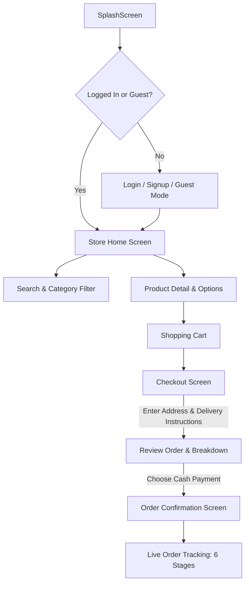

# 03. Flutter Mobile App Plan (Gas Station & Convenience Store Delivery)

## 1. App Overview & Roles
The mobile app serves two main user experiences:
1. **Customer View**: Browse store items, check delivery radius, cart, customize delivery instructions, choose cash payment, and track live order progress through 6 statuses.
2. **Driver View**: View orders ready for delivery, accept/pickup, view customer instructions & address, update status to `Out for Delivery` and `Delivered`, and collect cash.

---

## 2. Dependencies & Technology Stack

The app uses Flutter with **GetX** architecture:

| Package | Version | Purpose |
| :--- | :--- | :--- |
| `get` | `^4.7.2` | State management, routing, dependency injection. |
| `flutter_screenutil` | `^5.9.0` | Responsive UI across mobile screen sizes. |
| `socket_io_client` | `^2.0.0` | Real-time WebSocket connection for live order status. |
| `http` | `^1.6.0` | REST API requests to Backend. |
| `shared_preferences` | `^2.2.3` | Local storage for auth token, user info, saved addresses. |
| `cached_network_image`| `^3.3.1` | Fast, cached product image rendering. |
| `google_fonts` | `^6.2.1` | Modern clean typography. |
| `intl` | `^0.20.2` | Currency, date, and time formatting. |
| `fluttertoast` | `^8.2.4` | User alerts and toast feedback. |

---

## 3. Customer Screen Flow

### Screen Breakdown:
1. **Home Screen**:
   - Store banner & logo (*Gas Station & Convenience Store*).
   - Horizontal category chips (Drinks, Pop, Snacks, Ice, Automotive, Firewood, etc.).
   - Search bar & Promotions / Featured Carousel.
   - Grid of products with quick "Add to Cart", Price, Sale badge, and Stock indicator.
2. **Product Detail Screen**:
   - Product photo gallery, description, quantity selector (bounded by `maxPerOrder`), size/options.
3. **Cart Screen**:
   - Item list with (+) and (-) quantity buttons.
   - Price calculation: Subtotal + Estimated Tax + Tiered Delivery Fee + Tip options ($1, $2, $5, Custom).
   - "Free Delivery" progress bar (e.g., "Add $12 more for Free Delivery!").
4. **Checkout Screen**:
   - Fulfillment Toggle: **Delivery** vs **Store Pickup**.
   - Address selector / Delivery Area validator.
   - Delivery Instructions input: Preset quick buttons (*"Leave at front door"*, *"Call when you arrive"*, *"Side entrance"*, *"Meet in lobby"*).
   - Payment Selection: **Cash on Delivery**, **Pay at Door**, or **Cash at Store Pickup**.
5. **Order Tracking Screen (6 Statuses)**:
   - Visual step-progress bar:
     1. `Order received` ➔ 2. `Order confirmed` ➔ 3. `Preparing order` ➔ 4. `Ready for driver` ➔ 5. `Out for delivery` ➔ 6. `Delivered`
   - Real-time animated status changes received via Socket.io.
   - Estimated arrival countdown.

---

## 4. Driver Screen Flow
1. **Driver Orders List**: View orders marked as `Ready for driver`.
2. **Order Detail & Navigation**: Customer phone, delivery address, delivery instructions, total cash to collect.
3. **Status Action Buttons**:
   - `Pick Up from Store` (Transitions to `Out for Delivery`).
   - `Mark as Delivered & Cash Collected` (Transitions to `Delivered`).
