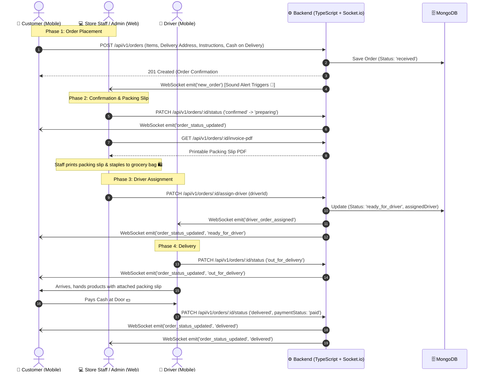

# 05. Complete Order Lifecycle & Communication Flow

---

## Order Status Mapping Across Components

| Status Key | Customer Display Title | Driver Action | Admin Action |
| :--- | :--- | :--- | :--- |
| `received` | Order Received | Waiting store confirmation | Audio alert plays; review order |
| `confirmed` | Order Confirmed | None | Accept order & start gathering items |
| `preparing` | Preparing Your Order | None | Pack items & print PDF packing slip |
| `ready_for_driver` | Ready for Pickup | Notification received; accept delivery | Hand packed bag with invoice to driver |
| `out_for_delivery` | Out for Delivery | En route to customer address | Monitor delivery progress |
| `delivered` | Delivered & Paid | Cash collected confirmed | Order marked completed in daily totals |
